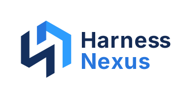

<p align="center">
  
</p>

<p align="center">
  <em>Self-hosted management for your coding agents: configure MCP servers,
  skills and model settings once, deploy them to your own machines, and chat
  with your agents from the browser.</em>
</p>

<p align="center">
  English | <a href="README.zh-CN.md">简体中文</a>
  &nbsp;·&nbsp;
  <a href="https://github.com/sinrimin/harness-nexus/actions/workflows/ci.yml"></a>
  &nbsp;·&nbsp;
  <a href="https://www.npmjs.com/package/@harness-nexus/cli"></a>
</p>

If you run coding agents — Claude Code, Codex, DeepSeek, OpenCode, pi,
Hermes — the same MCP server and API key end up configured in every tool, on
every machine. Skills and hooks drift apart, and there is no single place to
see what is installed where. Harness Nexus is that place: a server and web UI
you host yourself, plus a lightweight client (`hnx`) on each machine that
does the local work.

## What you can do

- Register MCP servers once, with credentials stored encrypted; the tools
  are then served to your agents through one endpoint, or through a local
  stdio shim on each machine.
- Bundle skills, hooks, sub-agents, rules and MCP servers into a profile and
  deploy it to a machine as one job. Claude Code installs profiles through
  its own plugin marketplace; Codex, DeepSeek and Hermes through
  `hnx install`.
- Enroll a machine with `hnx enroll`, see what is installed on it, import it
  back into the platform as resources, and push updates as jobs.
- Manage the agent CLIs themselves (Claude Code, Codex, DeepSeek, OpenCode,
  pi): install, upgrade or pin them remotely, push a default provider and
  model setup, and read each agent's config files with secrets masked — no
  SSH needed.
- Chat with any agent from the browser: streaming replies, tool-call cards,
  permission prompts, image and file attachments. Conversations stay on your
  machine; the platform stores no transcripts.

## Status

Alpha, under active development. The workflows above work today, with rough
edges. The CLI is on npm as
[@harness-nexus/cli](https://www.npmjs.com/package/@harness-nexus/cli)
(0.x alpha); Docker images arrive with the next release tag. Features, APIs
and the wire protocol can still change, so hold off on putting irreplaceable
data in it. Work is planned in
[issues and milestones](https://github.com/sinrimin/harness-nexus/milestones);
feature guides and design docs live in the
[wiki](https://github.com/sinrimin/harness-nexus/wiki).

## Quick start

### Docker

```bash
cp .env.example .env     # set JWT_SECRET (random string, ≥16 chars)
docker compose pull && docker compose up -d
open http://127.0.0.1:15922
```

The web port binds to 127.0.0.1 by default. Before exposing it beyond
localhost, put TLS in front of it (Caddy, nginx, …): the API transmits
tokens in headers, so serve it over HTTPS. If you plan to deploy profiles to
Claude Code through its plugin marketplace, also set `PUBLIC_BASE_URL` in
`.env` to your public https origin — the marketplace URL is built from it,
and the default (`http://localhost:8080`) only works while everything runs
on one machine. To build from source instead, run
`docker compose up --build -d`; the images build from CN package mirrors
(apt via TUNA, npm via npmmirror), so no proxy is needed — drop the mirror
lines in the Dockerfiles to use the official registries.

### From source (development)

```bash
pnpm install
export JWT_SECRET="$(openssl rand -base64 48)"   # required
export STORAGE_DRIVER=memory                     # optional: no database file
pnpm dev:server        # API on :8080
pnpm dev:web           # web UI on :5173
```

The first user to register becomes the admin.

### Connect a machine

On the machine you want to manage (the same host works fine):

```bash
npm install -g @harness-nexus/cli    # needs Node.js ≥ 20
hnx daemon --server https://your-instance --token <machine-token> --machine-id <machine-id>
```

Create the machine in the web UI first (Machines → Enroll) to get the
one-time token. The daemon keeps the connection, serves local MCP shims,
runs deploy jobs and hosts the chat processes. Remote chat is off by
default; enable it per machine (it executes tools on that machine,
owner-only).

## Security

- Credentials are encrypted at rest (AES-256-GCM); the UI only ever shows a
  masked preview.
- Tokens (personal access, machine enrollment) are displayed exactly once.
- Machine tokens work on the realtime channel only, not the REST API.
- Chat transcripts never leave the machine; inventory uploads redact env and
  header values first.
- Treat the instance and its `JWT_SECRET` as root for everything connected
  to it.

## Documentation

- [Wiki](https://github.com/sinrimin/harness-nexus/wiki): feature guides,
  design docs, research notes, the historical roadmap
- [`docs/architecture.md`](docs/architecture.md) and [`docs/adr/`](docs/adr):
  architecture contract and decision records
- [CONTRIBUTING.md](CONTRIBUTING.md): how development is organized

## License

[MIT](LICENSE)
